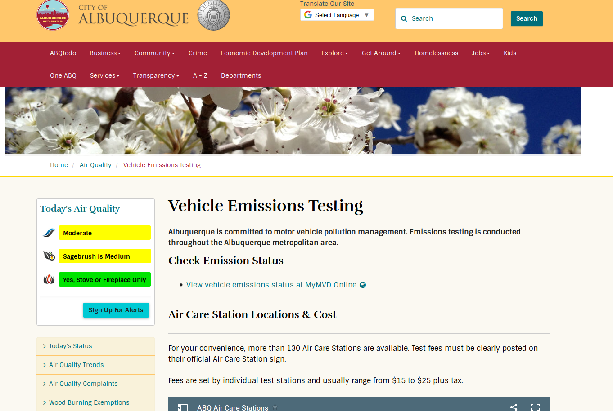
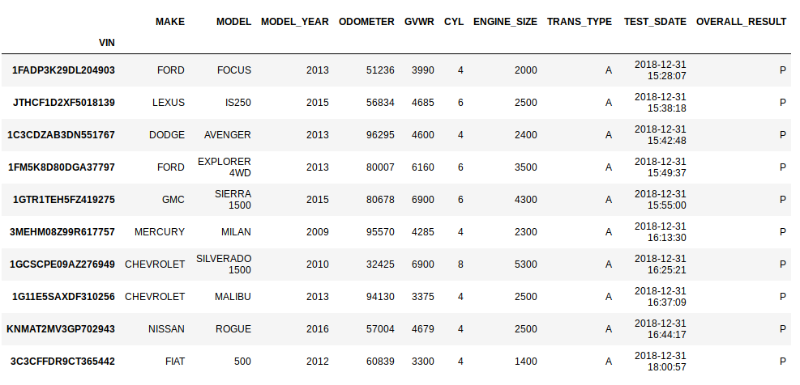

------------------------

 

------------------------

# The brief

> Hi, this is Nisha, I work at the Albuquerque Environmental Health Department. We are on a mission to improve the air quality in our city. Our current mission: get polluting cars off the road and repaired **before** they are coming in for their regular emissions check. Can you help us?

------------------------

# Raw data: all car emissions tests in Albuquerque from 2004 to 2018

 

\+ over 100 additional columns with detailed results from the emissions tests (measurements etc)

------------------------------------

# Data preparation

* Remove cars with invalid VINs
* Remove cars that have been used for training emissions inspectors
* Remove cars that were tested by inspectors with invalid ID (HELL666)
* Make a random sample of 10% of cars (=keeping all inspections for each car in the sample)
* Details + all code for cleanup in [cars_cleanup_and_sample.ipynb](cars_cleanup_and_sample.ipynb

-------------------------------

# Data overview 

|   | __original__  | __cleaned__  |  __sample__ | 
|---|---:|---:|---:|
|  __# cols__  |  127 | 127  | 127  | 
|  __# rows__ |  4,091,788 |  3,526,232 | 353,364  | 
| __# cars __ | 1,337,877 | 1,241,697 | 124,469 | 
|  __\% fail __ |  11.3 | 8.8  | 8.8  | 
|  __file size__ | 1.73 GB  |  1.47 GB |  147 MB | 

------------------------

# Links

* Project info
    * [\link{ Albuquerque open data portal}](https://www.cabq.gov/abq-data/)
    * [\link{Data dictionary}](http://data.cabq.gov/airquality/vehicleemissions/MetaData.pdf)

* Data
    * [\link{Original}](http://data.cabq.gov/airquality/vehicleemissions/prioryears/)
    * Cleaned (full data and sample): link by email

*  Data preparation code: [cars_cleanup_and_sample.ipynb](cars_cleanup_and_sample.ipynb)

